# Adnroid Studio —— gradle故障解决

> `Gradle sync failed: Cause: unable to find valid certification path to requested target`
>
> 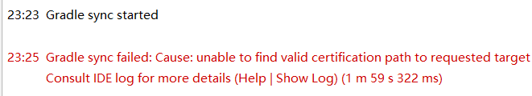

## gradle包的更换

- 去https://services.gradle.org/distributions/下载对应的all.zip

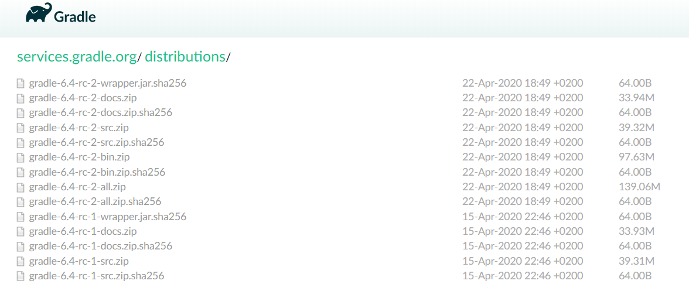

- 覆盖zip文件

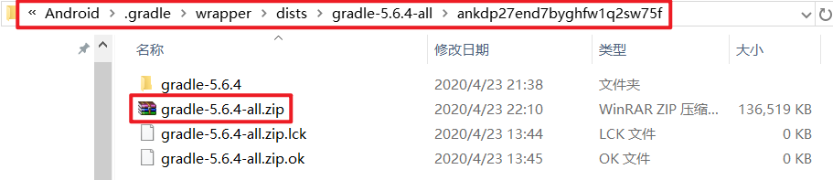

## build.gradle设置

外层build.gradle内两个repositories设置：

```grovy
maven{url'http://maven.google.com' }
maven{url'http://jcenter.bintray.com'}
maven{url'http://maven.aliyun.com/nexus/content/groups/public/' }
maven{url'http://maven.oschina.net/content/groups/public/'}
google()
jcenter()
```


## Project模板设置

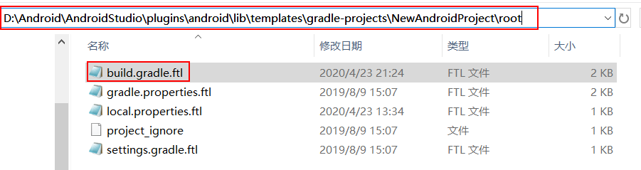

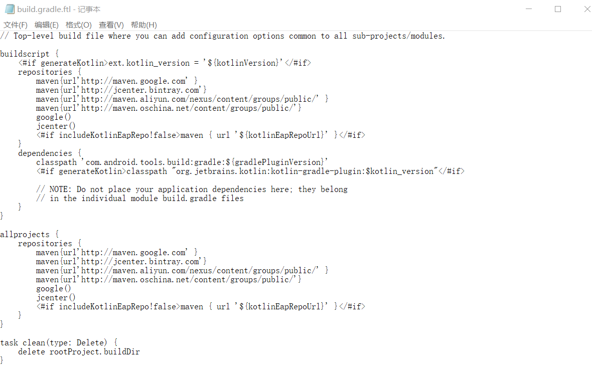

## 软件设置

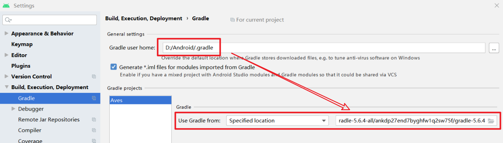

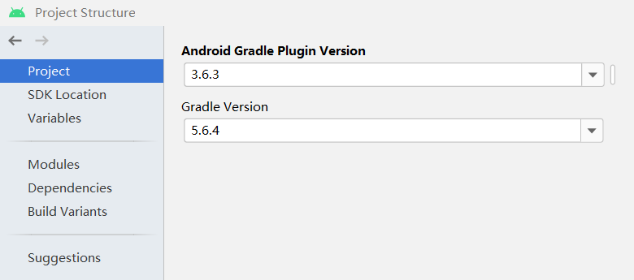

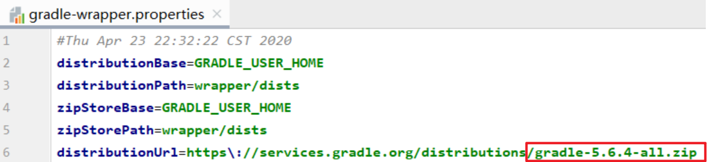

## JAVA_HOME设置

系统环境变量的JAVA_HOME设为AndroidStudio安装路径下的jre路径

- 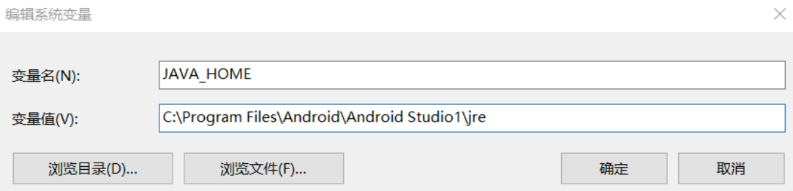

## 证书手动导入

- 网页下载证书到本地创建的.cer文件：https://maven.aliyun.com/mvn/view

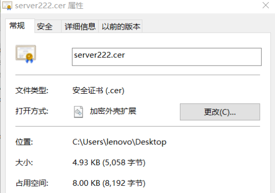

- 管理员身份打开CMD向JAVA导入证书：

- 执行 keytool -import -file server222.cer -keystore "%JAVA_HOME%\jre\lib\security\cacerts" -alias server 
- -file 后面是刚导出来的 server.cer 文件路径
- -alias server 表示别名是 server
- JAVA默认密钥为：changeit
- 确认信任此证书
-  出现下面提示，表示正常导入到 %JAVA_HOME% 里面

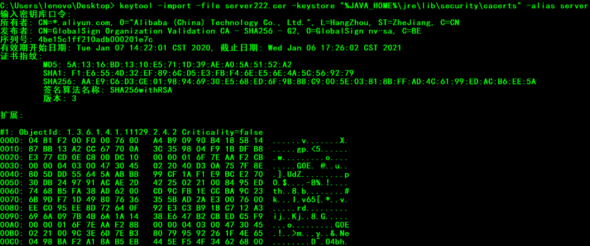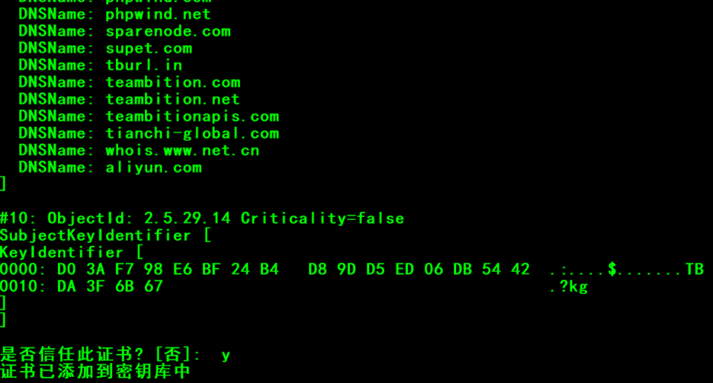
