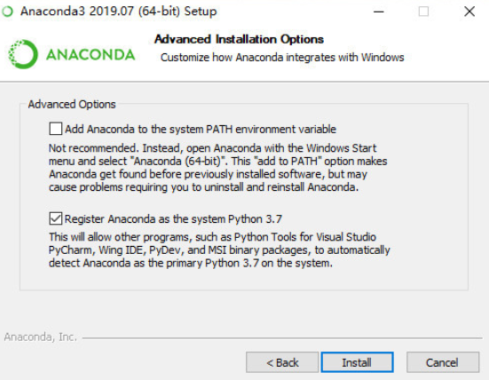
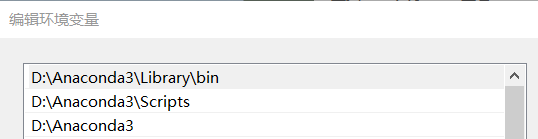
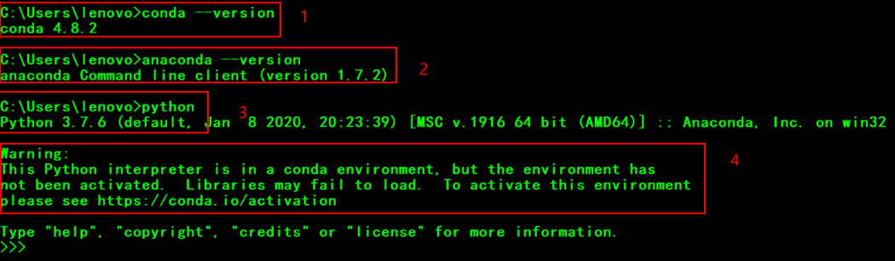
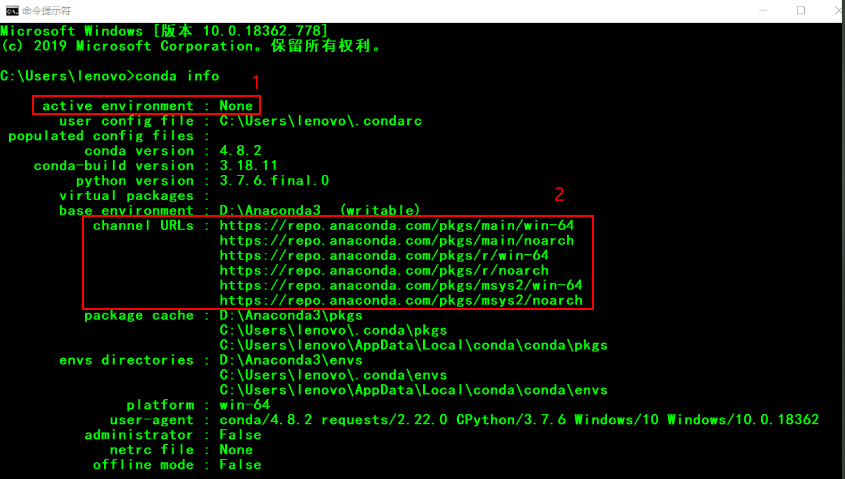
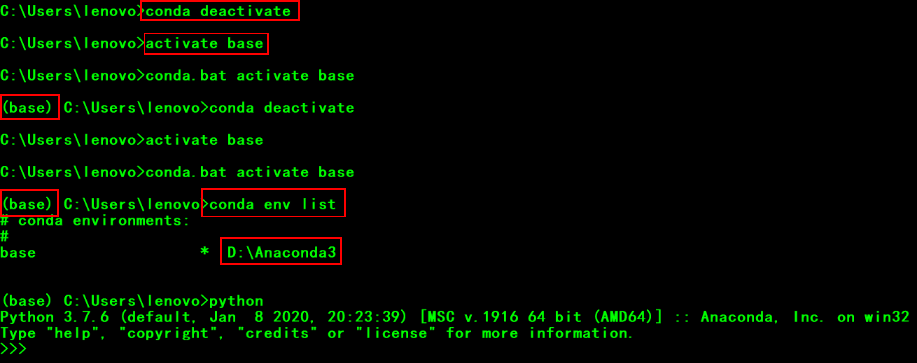
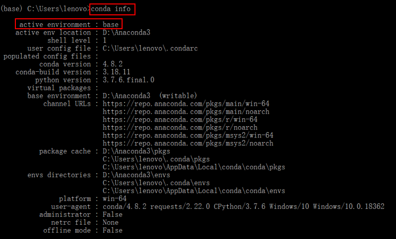
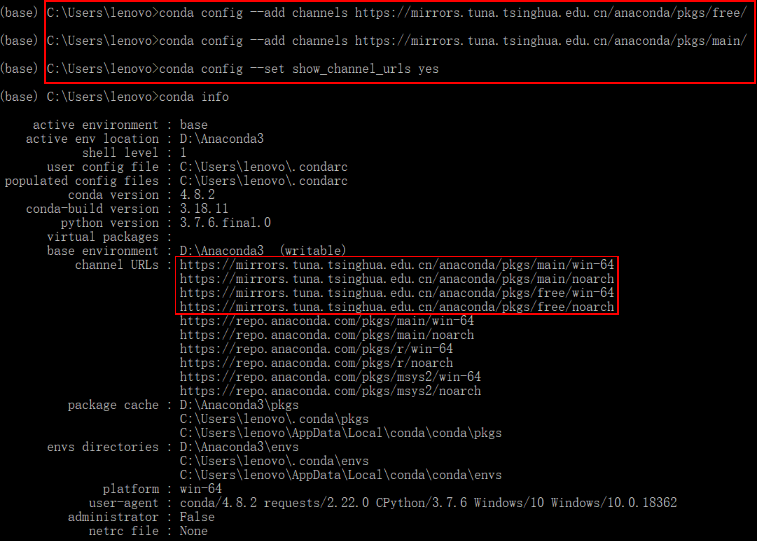
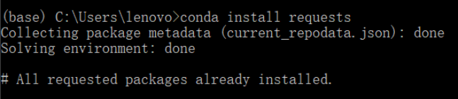
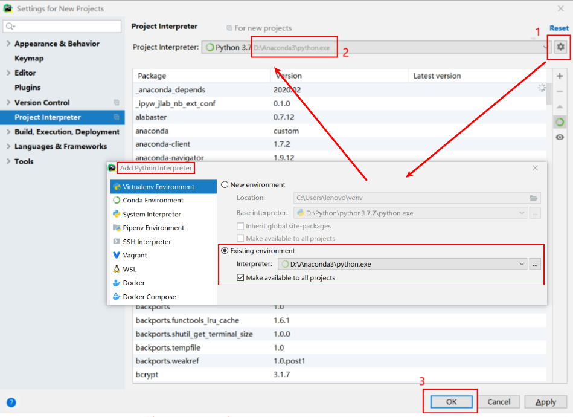
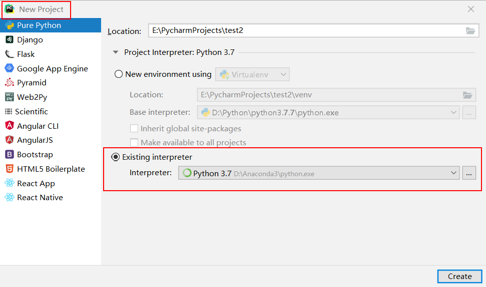

# Anaconda 安装

## 下载

- 官网：https://www.anaconda.com/distribution/

- 国内镜像：https://mirrors.tuna.tsinghua.edu.cn/help/anaconda/

## 安装

- 安装程序执行

  > 顺畅安装
  >
  > 自定义安装目录
  >
  > 不要使其自动设置环境变量，后续手动设置较为灵活

- 系统环境变量设置

  > 用户变量位置的path中的Python目录不和系统环境变量中的path内的Anaconda目录共存

  

## 初始化

### 验证Anaconda是否安装成功

- `conda --version`

- `anaconda --version`

- `python`

  > 警告：由于Anaconda还未存在被激活的Python环境

  

### 查看Anaconda初状态

- 打开`CMD`输入 :`conda info​`

  > 1.已激活的Python环境为None，需要手动选择激活
  >
  > 2.用于下载的URL，国内可能访问不了，需要添加国内镜像

### 激活Python环境

- `CMD` 输入：`conda env list` 列出所有Anaconda内的Python环境

- `CMD` 输入：`activate base` 激活默认的base标识的Python环境

- `CMD` 输入：`conda deactivate` 关闭被激活的Python环境

  > 当Python环境激活后，命令前会出现环境名，如下图中的base

  

- 环境激活验证

  

### 添加国内下载镜像

- `conda config --add channels ` https://mirrors.tuna.tsinghua.edu.cn/anaconda/pkgs/free/ 
- `conda config --add channels` https://mirrors.tuna.tsinghua.edu.cn/anaconda/pkgs/main/ 
- `conda config --set show_channel_urls yes`

### Anaconda内的包更新下载

- `conda upgrade --all` 将Anaconda内的所有包进行更新

- 更新结果验证

  

  

## `Pycharm`的Anaconda内的Python环境配置

### Pycharm导入Python环境

- `setting `$\rightarrow$`Project Interpreter`
- 通过1的设置来从目录中找到2所示的Anaconda内的Python解释器并选择加入解释器列表

### 项目导入环境

- 新建项目时手动选择已导入的Anaconda内的Python解释器即可

