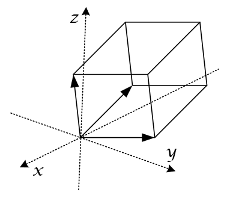
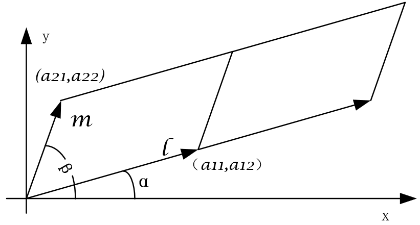
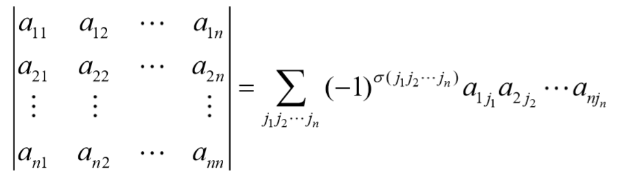
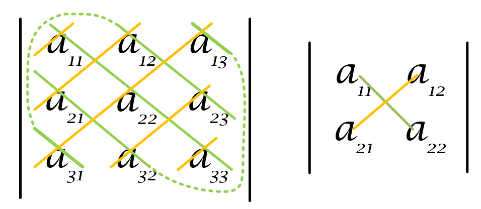

# 行列式

## 行列式的定义与性质

### 几何法

行列式的本质是研究**向量**。行列式的结果的本质，是将行列式中的行数据作为空间直角坐标系中的向量，以这两个向量为邻边的平行四边形的面积或体积。

两个向量在空间直角坐标系中所组成的二维平行四边形面积，三个向量在空间直角坐标系中所组成的平行六面体，多于三行的向量组成相应维数的结果。因此行列式的性质可以根据这个本质来理解。

### 7大性质

> 习惯上写列向量$\alpha = {a_1,a_2,...,a_n}$

1. 如果行列式中某一行（列）元素全为零，则行列式等于零；

   > 某一向量为0，则组成的面积或体积为0

2. 如果行列式中某两行（列）元素对应成比例，则行列式等于零； 

   > 两个向量成比例，则向量重合，面积或体积为0

3. （互换）互换行列式中某两行（列）元素的位置，行列式的值只改变正负号； 

   

   > 两个向量互换，则面积为相反数

4. （倍乘）常数k 乘以行列式，即行列式的某行（列）元素分别乘以k ； 

   > 改变一个向量的倍数则面积就变为相应倍数，无需每个向量都成倍.

   

5. （倍加）将行列式的某一行(列)的所有元素都乘以数k 后加到另一行(列)对应位置的元素上, 行列式的值不变； 

   > 倍加运算本质上是进行了剪切变换，没有改变面积。

   

6. （单行可拆（加）性）如果行列式中某一行（列）的每个元素都是两个数的和，则这个行列式可以拆成两个行列式的和；

   >  **注意**：多于一行不同就不可以加；正轴上的面积

   

   

7. 行列式与它的转置行列式相等, 即 $|A|=|A^T|$ ;

   > 行列式中行向量所有的性质和列向量所有的性质相同

### 重要观点

1. 行列式由n个n维向量组成，其结果是以这n维向量为邻边的n维图形的体积。

   

2. 

   $|A|_{n*n} \not= 0  \rightleftarrows  S\not=0 \rightarrow 各向量不重合/成倍 \rightarrow 各向量独立/线性无关$

   $|A|_{n*n} = 0  \rightleftarrows  S=0 \rightarrow 各向量不重合/不成倍/有0向量 \rightarrow 各向量不独立/线性相关$

   将n行向量想象成n个齐次方程的系数，那么这n个齐次方程两两独立，也即每个方程都不能由另一个方程替代。也就叫做独立。

   - $|A|_{n*n} \not= 0 \rightleftarrows$ n个n维向量线性无关

   - $|A|_{n*n} = 0 \rightleftarrows$ n个n维向量线性相关

### 逆序法

> 逆序
>
> - 54321: 逆序数= $4+3+2+1 = 10$

- 展开后有 **$n！$**项（全排列）；

- 每项是取自**不同行，不同列**的 n 个元素的乘积

- **行下标顺排后**，每项前乘以$(-1)^{\sigma(j_1j_2...j_n)}$ 。

  > 必须在行下标顺排的情况下计算列的逆序数
  >
  > - $a_{12}a_{23}a_{31}a_{45}a_{54}a_{66}$的逆序数为3，前面添负号
  > - $a_{45}a_{16}a_{53}a_{22}a_{64}a_{31}$先转换为$a_{16}a_{22}a_{31}a_{45}a_{53}a_{64}$ 逆序数为8，前面添正号
  >
  > 次方位置为逆序数=行数+列数
  >
  > 正负取决于逆序数的奇偶

- 除主对角线上元素，其它元素都为0的矩阵的值=主对角线累积

> 全排列中除了主对角线上 $a_{11}a_{22}...a_{nn}$ ，别项中的不同行不同列的累加元素中必有0，而使得该项为0，
>
> 别项均=0，又因为对角线元素的全排列中元素的行列值均相等，逆序数为0，行列式的结果=对角线元素累积

### 展开法

## 行列式的计算

### 低阶

- 二阶：交叉相乘再相减
- 三阶：沙路法
- 以上：初等行变换

### 高阶

#### 消0化三角形

#### 消0降阶

#### 拆项

#### 加边

#### 范式

#### 数归&递推