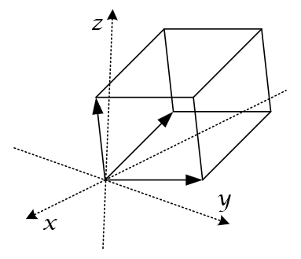
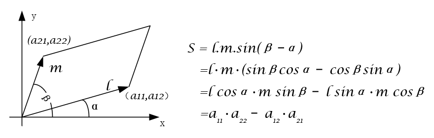
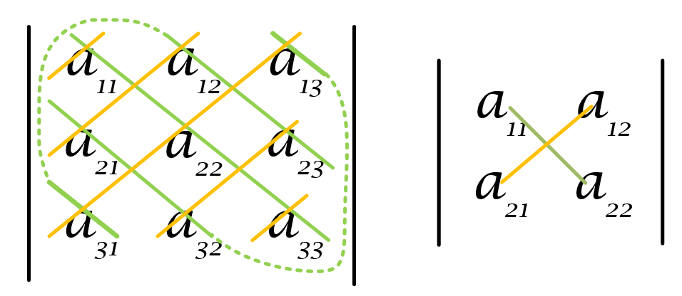
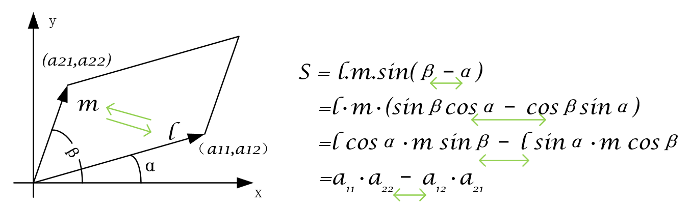
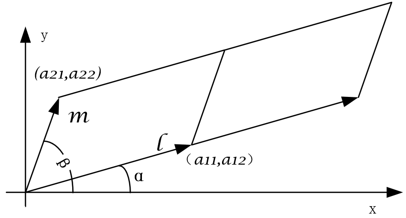

# 线性代数基础

## 基础——行列式与矩阵

### 行列式

行列式的结果的本质，是将行列式中的行数据作为空间直角坐标系中的向量，以这两个向量为邻边的平行四边形的面积或体积。

两个向量在空间直角坐标系中所组成的二维平行四边形面积，三个向量在空间直角坐标系中所组成的平行六面体，多于三行的向量组成相应维数的结果。因此行列式的性质可以根据这个本质原理进行理解。

行列式的本质是研究**向量**

#### 计算方式

- 二阶：交叉相乘再相减
- 三阶：沙路法
- 以上：初等行变换

#### 性质

1. 如果行列式中某一行（列）元素全为零，则行列式等于零；

   某一向量为0，则组成的面积或体积为0

2. 如果行列式中某两行（列）元素对应成比例，则行列式等于零； 

   两个向量成比例，则向量重合，面积或体积为0

3. （互换）互换行列式中某两行（列）元素的位置，行列式的值只改变正负号； 

   

   两个向量互换，则面积为相反数

4. （倍乘）常数k 乘以行列式，即行列式的某行（列）元素分别乘以k ； 

   改变一个向量的倍数则面积就变为相应倍数，无需每个向量都成倍

   

### 矩阵

## 核心——向量组和方程组

### 向量组

### 方程组

## 应用——特征值和二次型

### 特征值

### 二次型