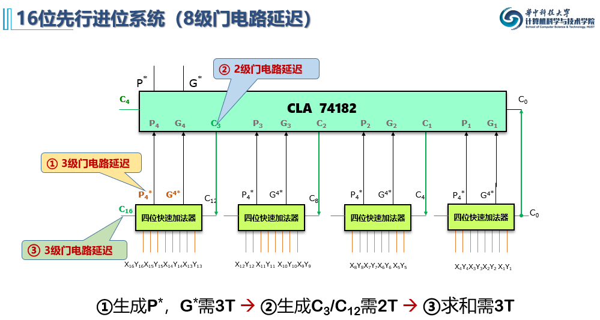

# 定点补码加/减法运算

## 概述

**整数的加减法**在计算机内使用**补码**表示，以解决整数的**正负和减法**问题。本章节首先讨论两个二进制补码相加的**溢出**情况，得到**溢出检测**的方式。再从**一位二进制**的加减法的电路设计和逻辑表达式开始，逐步扩展到**串行进位**，**并行进位**，**组间并行进位**的逻辑表达式和电路设计。

## 基础

### 溢出

- 正溢出：绝对值太大：正正得负
- 负溢出：绝对值太小：负负得正

### 溢出检测

> 溢出检测信号 $Overflow(OF) = 1 $ 时溢出

#### 单符号溢出检测方法

- **两数符号位$f_0,f_1$，和数符号位$f_s$**
  - 
  - $Overflow = \bar{f_0}\bar{f_1} f_s + f_0 f_1\bar{f_s}$
  - 溢出只有110和001的情况，001由$\bar{f_0}\bar{f_1} f_s $保证，110由$ f_0 f_1\bar{f_s}$保证，或运算：两者皆可检测到

- **符号位进位$C_f$及最高位进位$C_n$**
  - 
  - $Overflow = C_f \oplus C_n$
  - 溢出仅当$C_f$和$C_n$不同时存在/不存在时发生，即00与11时不溢出，01或10时溢出，即异或$\oplus$逻辑

#### 双符号位溢出检测

- **第一符号位 $f_1$，第二符号位 $f_2$**
  - 	
  - $Overflow = f_1 \oplus f_2$
  - 正溢出时仅改变第二符号位，负溢出时第一符号位被复位
  - 当两个符号位不同则发生溢出，即异或逻辑
  - 双符号位的最高位永远是正确的符号位，如10负溢出，01正溢出

### 一位加法

- 半加器：只考虑本位和，不考虑低位进位和高位进位（不详解，原理蕴含在全加器中）
- 全加器：考虑本位和，低位进位和高位进位

#### 本位合$S_i$

> 本位和：$S_i$	运算数：$X_i  Y_i$ 	低位进位：$C_i$	高位进位：$C_{i+1}$

- **半加器本位和公式：$S_i = X_i \oplus Y_i $**
  - 
  - 列举可得相同出0，相异出1。即异或逻辑。

- **全加器公式**

  - 
  - **本位和公式：$S_i = X_i \oplus Y_i \oplus C_{i}$**
    - 理解为半加器的本位和再与低位进位异或，相同出0，相异出1
    - 三个数异或，只当有奇数个1时结果为1
    - 3个输入，也即1或3个输入1时本位=1
  - **高位进位公式：**
    - $C_{i+1} = X_i Y_i+(X_i\oplus Y_i)C_i$
      - $X_i Y_i$ 代表算数位本身全1构成进位
      - $(X_i\oplus Y_i)C_i$代表在$X_i$与$Y_i$相异，即当中仅有一个1时，由进位$C_i$和算数位共同构成进位$C_{i+1}$
      - 与或式使得两项中任意一项满足则产生$C_{i+1}$
      - 当三个输入同时为1时，仅满足第一个与或式
    - $C_{i+1} = X_i Y_i+(X_i+Y_i)C_i$
      - $(X_i+Y_i)C_i$使得算数位一个1和$C_i=1$满足，同时三个输入同时为1也满足

  - **电路实现**
  - 
    - 3级门电路延迟：最长路径为3段
    - $S_i$由两级异或门组成
    - $C_{i+1}$由两级与门和一级或门组成

## 串行进位加法

- n位加法器由n个全加器串联组成
- 低位芯片的进位输出连接到高位芯片的进位输入，从而高位的运算依赖低位的运算
- n个全加器延迟，$3n$个门电路延迟(每个全加器内3级门电路延迟)

### 溢出检测

##### 单符号：$Overflow = C_f \oplus C_n$

**双符号：$Overflow = f_1 \oplus f_2$**

## 补码减法

- **$[X]_{补}+[Y]_{补} = [X+Y]_{补}$**
- **$[X]_{补}-[Y]_{补} = [X]_{补} + [-Y_{补}] = [X-Y]_{补}$**
- $[-Y]_{补} = [[Y]_{补}]_{补}$
  - 补码加法的逻辑与补码减法的逻辑一致
  - 减法时将原本为减数的第二个加数，转换作其的变补运算结果即可
  - 变补运算与负数的补码不同，区别在于在逐位取反包括符号位后+1
    - 变补运算也可从右至左，第一位1之后逐位取反，包括符号位
- 引入控制位Sub来控制使用加法器时第二个加数为$[Y]_{补}$还是$[[Y]_{补}]_{补}$
  - 
  - 
  - Sub=1时作减法：变补运算，输入$[[Y]_{补}]_{补}$
    - 逐位取反的实现
      - 异或门处Y=1时，两数相同，则异或输出0，使得Y取反=0
      - 异或门处Y=0时，两数相反，则异或输出1，使得Y取反=1
    - 末尾+1的实现：低位进位$C_0$端输入Sub=1
  - Sub=0时作加法：$[Y]_{补}$保持不变
    - 异或门
      - Y=0时，两数相同保持0
      - Y=1时，两数相异保持1
    - $C_0$ 进位=0

## 加法器特征

- 所有算数都基于加法器实现

- 加法器不区分符号数和无符号数

- 加法器取低n位为结果，生成标志信息

  #### 标志寄存器

  

## 片内并行进位

> 提前产生各位的进位输入，使得高位不依赖于低位的进位输入而等待。使得各位的加法运算可以并行，提高多位加法器的运算速度

##### 逻辑表达式推导

- 本位和依然是2个本位数与低位进位的三个数相与
- 高位进位的公式前文已经解释过
- 将进位的公式拆分
  - 进位生成函数 $G_i = X_i Y_i$ 代表仅由本位数相加构成的进位(全1出1)
  - 进位传递函数$P_i=X_i \oplus Y_i $代表当两个数值位中仅有一个1时，配合低位进位$C_{n-1}$能够传递。

**递归通式**：

- 高位进位的判定是一个与或式，每一个与项代表一种进位可能

- $G_n$代表仅由$X_n,Y_n$所构成的进位

- $P_nG_{n-1}$：$P_n$表示第n位两个算数位只含一个1，$G_{n-1}$表示第n-1位的两个算数位构成向第n位的进位，使得第n位存在向高位的进位

- PG项以此类推，高位不断地以P出现，只要保证最后一位存在G即可。

- 最后一个与项，表示在所有算数对均只含一个1的情况下，最后由低位进位不断传递到第n位构成向上的进位。

- 由此可得，所有高位进位，都只与最低位的进位输入$C_0$有关

- 由于位数越长，进位链电路复杂度越高，因而按照4位一组进行分组运算。

  **电路构造**

  

  - 通过一级门电路。
  - 与门&构成进位生成函数G
  - 异或门生成进位传递函数P

## 先行进位电路

- 生成P,G的电路输出接入到先行进位电路。
- 输出每一位的进位数据
- 除每一位的G外，$P G C_0$均以与或式存在，因此有两级门电路延迟
- 每一位均有i个与门，共有i+1接入各自的或门

## 快速加法器

- 本位和是两个本位数与低位进位的异或，低位进位输入通过先行进位电路得到，因此只需要一级异或门即可完成本位进位
- $X_i \oplus Y_i  = Pi$  从而异或门输入可以直接利用与门异或电路产生的输入到先行进位电路的P,从而产生本位和，实现快速加法的目的。

- 四位快速加法器的输入$X_i Y_i$共有4对，先经过与或异或电路转变为P,G输入到四位先行进位电路中输出各位的进位C，最后通过向异或门输入C与P来得到本位进位。

## 组内并行进位

4位快速加法器通常为一个单元，如果想要以这样的单元构成更多位的快速加法器，如16位所需4位快速加法器，那么最直接的方式是将各个4位快速加法器的进位输出输入端串连，但这种方式,与片内串行进位的弊端一样，由于高位依赖于低位的进位信号，高位芯片依赖于低位芯片的进位信号，因此计算过程等待进位信号传输的时延过大，因此需要以片内并行进位的逻辑设计芯片组间并行进位。

### 逻辑表达式推导

- 将一组四位的快速加法的进位划分为$P^*$，$G^*$
- $G^*$包含只由数值对的和构成进位的4种可能的与项G的与或式
- $P^*$包含只由低位进位$C_0$传递的进位
- 本质上，组间并行进位和组内并行进位的原理一致，仅仅是具体的逻辑表达式有区别，造成的电路则有区别。

### 电路构造

- 输入的数据分别为与门异或门电路产生的各算数位对应的G,P。
- 通过P,G可先行构成除最高位的各位先行进位信号C。由本电路通过各位的P,G产生$G^*,P^*$传递到下一个芯片构成本芯片的最高位的进位信号C，从而降低门电路延迟。（就还好吧）

### 先行进位电路$CLA74182$

### 四位运算器芯片$SN74181$

> 先行进位的多功能算数/逻辑单元

- 算数位：$A_1 B_1 -- A_3 B_3$
- 输出位：$F_0 -- F_3$, 低位进位输入 $\bar{C_n}$  , 高位进位输出 $\bar{C_0}$  ,
- 操作状态控制位$S_0 -- S_3$ , M逻辑/算数运算选择位  。 总共$2^5$种操作
- P,G端为用于组间先行进位的P,G信号
- A=B用于判断两数是否相等，相等相减则结果为0

### 16位先行进位系统

- 第i片四位快速加法器的成组进位P,G连到$CLA74182$的$P_i^*,G_i^*$端
- $CLA74182$的$C_0$到$C_3$接收各个四位快速加法器的最低位进位输入，根据成组进位生成函数产生进位来进行运算，降低由于等待进位信号而产生的时延。
  - $CLA74182$同时产生自己向高位的进位C4，以及自己的先行进位信号$P_i^*,G_i^*$
- 门电路延迟
  - 四位快速加法器的3级门电路延迟
    - 与门异或门的1级延迟，生成片内P,G
    - 4位先行进位电路的与或式2级延迟，生成片内进位C和成组进位$P_i^*,G_i^*$
    - 产生本为和的异或式最后算
  - $CLA74182$的2级门电路延迟
    - 先行进位电路的与或式2级延迟，生成片内进位C和成组进位$P_i^*,G_i^*$
    - 产生本为和的异或式延迟最后算
- 求本为和S的每一位3元素的异或项，为什么需要$3T$？

### 32位先行进位系统（时间延迟？）

由于只需要两个$CLA74182$集联即可构成32位先行进位系统，因此不需要并行进位，串行进位即可。

### 64位先行进位系统（12级门电路延迟）

- 四位先行进位系统3T
- 每一级$CLA74182$需要2T
- ？??
- 求和需要3T

