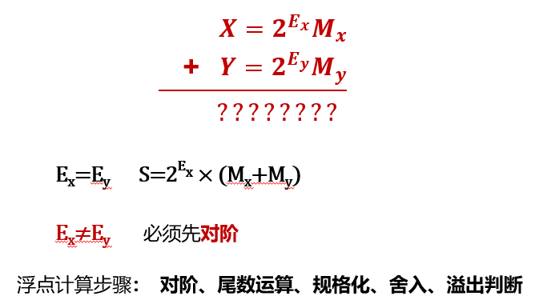

# 浮点运算

## 浮点加减法运算

- 计算机中的浮点数时使用阶码与尾码表示的
- 浮点数计算时首先需要考虑两个浮点数的阶码是否相同
  - 相同才能直接进行尾数的相加减
  - 不同的话，则需要转变到阶码一致后才可以进行下一步运算

在对阶过程中，往往将小阶数转换为大阶数，阶码左移，尾数进行右移

- 浮点数存储的尾数位数有限
- 如果大阶转小阶，阶数减小右移，尾数增大左移，那么大数的尾数前面会被溢出缺失，数值越大则尾数左移时缺失造成的影响就越大。
- 如果小阶转大阶，阶数增大左移，尾数减小右移，那么小数的尾数后面会被溢出缺失，数值越小则尾数右移时缺失造成的影响就越小。

- 规格化浮点数的尾数小数点后第一位为1,也即尾数绝对值>=0.5
- 运算结果规格化也即将尾数的首位=1
- 目的是保证浮点数的编码的唯一性
- 尾数右归，阶码左移增大
- 尾数左归，阶码右移减小

- 左归可多位
  - 左归是由于尾数太小而需要增大
  - 数值的尾数越小则需要左移的尾数越多，尾数可以很小
  - 例如0.99999-0.99998=0.00001，需要左移4位
- 右归最多一位
  - 右归是由于尾数太大而需要减小
  - 数值的尾数越大则需要右移的尾数越多，
  - 例如0.99999+0.99999=1.00002，最多只需要右移1位
- 
  - 