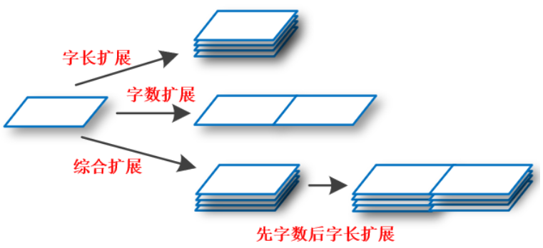
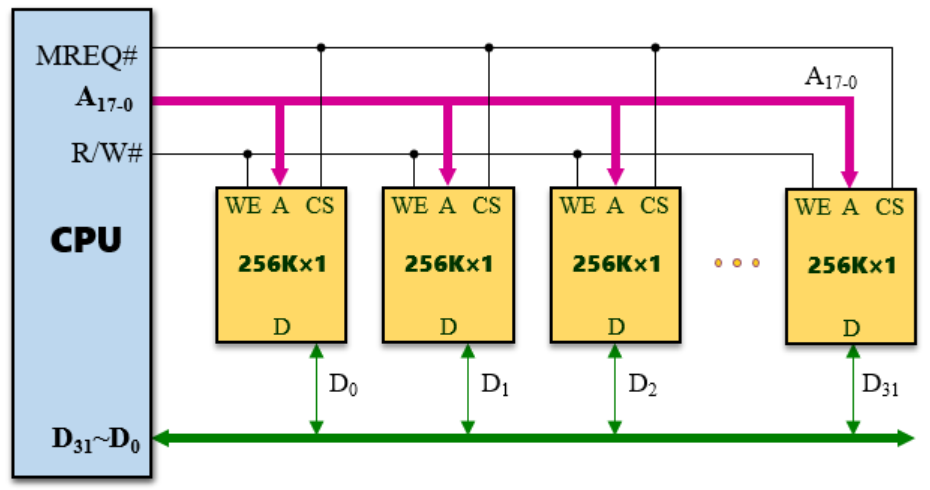
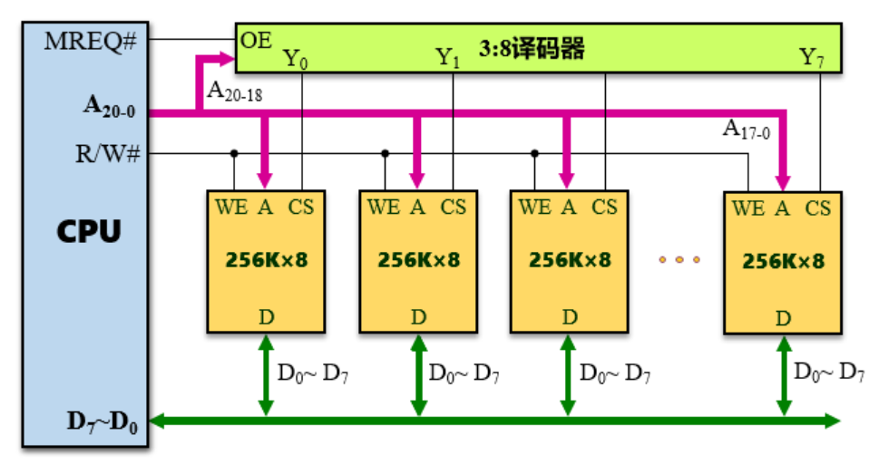

### 存储器的扩展

**概述**		

存储器通过地址线，数据线，控制信号线与CPU连接，CPU根据地址线传输存储器中需要访问的特定地址，通过数据线进行数据比特的传输，通过控制信号线传输操作控制的信息。

存储器的扩展是指：选用多片小的芯片构成一个大的存储器。芯片具有字长和字数两种属性，对应存储器的两种扩展方式：字长扩展和字数扩展。前者适用于单片芯片的字长与需要构成的存储器的字长不一致的情况，后者适用于单片芯片和需要构成的存储器的字数不一致的情况。当字长与字数都不一致时，需要进行综合扩展：先字长扩展后字数扩展。

对于存储器扩张的形象理解如下：将芯片和存储器理解为三维，字数标识芯片具有多少个位平面，字长标识每个位平面的面积。字长扩展就是将相同面积的位平面在不同层次上叠加，字数扩展就是将位平面层数相同的芯片（组）组成更大的面积。

**字长扩展的硬件理解**

- 使能端CS并联，实现多个芯片的接通状态一致。
- 地址线A并联，实现多个芯片内选中的地址位置一致。
- R/W读写控制线将WE读写控制端并联，实现多个芯片被指派同一I/O操作。
- 多个芯片的D端同时接入数据线，芯片组的I/O数据由各个芯片的I/O数据共同组成。

如下图，每个芯片的字长为1，共有32个芯片，则数据线传输的数据为31位。

**字数扩展的硬件理解**

- 同级别的芯片增多导致地址位数增多，从而将地址码划分为高位片选地址和低位片内地址。
- CS使能端接收从译码器输出的片选信号，控制某块芯片(组)被接通从而被选择。
- 各个芯片(组)的A端接收片内地址，但只在该芯片(组)的CS端同时接通的情况下才能选择片内单元。
- R/W读写控制线将WE读写控制端并联，控制被选中的芯片(组)的I/O操作。
- 各个芯片的D端同时接入数据线，但只有CS端接通的芯片(组)才能传输I/O数据。

如下图中的每块芯片(组)字长为8，那么地址线中传输数据为8位。

**综合扩展的理解**

综合扩展是字长扩展和字数扩展的组合，首先进行字长扩展组成符合特定字长要求的芯片组，再将这些芯片组以组为单位通过字数扩展成符合特定字数要求的存储器。

芯片组内部是字长扩展：本组所有芯片的CS使能端并联来统一接通状况，本组所有芯片的A端并联来接收同一片内地址，本组所有芯片的WE端并联接收R/W读写信号来控制本组同一读写行为，本组所有芯片的输出端也共同接入数据线。

芯片组外部是字数扩展：CS使能端根据片选码的译码结果来控制哪个芯片组被统一调度，片内地址传输给各个芯片组，但只有CS端被接通的芯片组才能通过片内地址选取数据并进行整组芯片数据的输出。