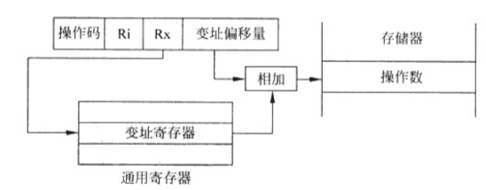
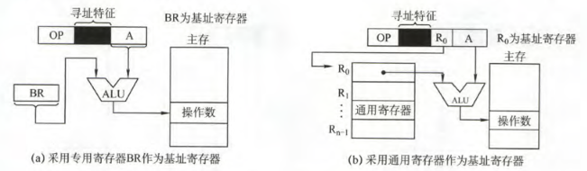

# 寻址方式

## 概述

- 寻址方式面向对象
  - 指令寻址
  - 数据寻址
- 寻址方式
  - 隐含寻址：将操作数地址隐藏；例如通过累加器$ACC$进行暂存。
  - 立即数寻址：操作码保存操作数
  - 直接寻址：操作码直接操作数的存储器地址
  - 间接寻址：操作码保存存储器中操作数的地址的地址（保存指针）
  - 寄存器间接寻址：操作码保存 存储操作数指针的寄存器地址
  - 变址寻址：变址偏移量与变址寄存器的值相加得到操作数的地址
  - 相对寻址：变址偏移量和PC程序计数器的值相加得到操作数的地址
  - 基地址寻址：将程序所用地址和基地址寄存器中的值相加得到地址
  - 堆栈寻址：自动采用堆栈指针SP，一般无需操作数

## 寻址方式详解

### 立即数寻址

### 直接寻址

### 间接寻址

### 寄存器间接寻址

### 变址寻址

### 相对寻址

### 基址寻址

