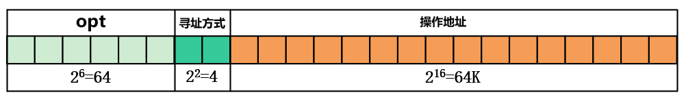
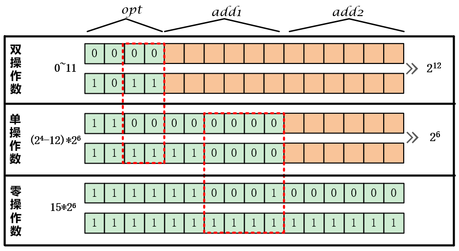

# 指令二进制序列的基础理解

## **指令格式**

用二进制代码表示指令的结构形式

指令要求计算机处理什么数据？  寻址方式+地址码（由于内存地址寄存器和主存全地址的长度方式差异过大，因此需要根据不同的寻址方式（根据某些部分地址）来组成地址码字段）
指令要求计算机对数据做什么处理？ 操作码字段
计算机怎样才能得到要处理的数据？

## 扩展操作码

扩展操作码是变长操作码中的一种。由于操作数存在双，单，无操作数的情况。

由于指令中高位为操作码，根据操作数的单，双，无的情况，剩余的操作码位数的不同也使得不同状态表示的总指令数的上限不同。由于实际设计的指令数通常达不到上限，因而多余的状态可以用于设计其它操作数的指令。注意通过剩余指令的设计需要从短地址开始，也就是从多位操作数开始，使得选用高位码作为操作码，然后将其剩下的状态与低位的码项组合成其它操作数的操作码。

指令存在长度和地址的不同，操作数和地址数一致，长度表示整条指令的长度。通常需要指明计算机的字长，然后标明指令属于单字长，双字长，半字长。指令的条数本质上是由以不同状态表示的操作码决定的，单操作码是由一定位数组成的，需要保证分配的位数能够包含所有指令状态。

