### 计算机组成原理 —— cache地址映射

​	为缓解CPU速度较快，而主存访问速度较慢的差异，使用由速度较快的SRAM存储主存数据块的副本来加快数据的读取。cache通过cache查找表CAM（相联存储器 content address memory）和SRAM进行工作，先在cache查找表内根据查找的命中与否(miss/hit)来决定是否读取cache副本。cache副本中以块为单位进行存储，当读取某块内字时，需要将该字所在的块整体读入cache中。

​	将主存块定位到Cache中的方式规则称为地址映射。地址映射分为全相联映射，直接相联映射和组相联映射。

​	三种映射方式的本质差异，可以体现为，在对主存地址的编址上，全相联映射不设组，任意cache块均可为任意主存块。直接相联映射将cache分为cache行数个组，主存块只能被加载入mod Cache相应余数作为cache行数的位置。组相联映射将cache分成若干组，组类全相联映射。

​	全相联映射的限制低，存储效率高，但采用顺序比对从而cache比对的速率低，适合较小的cache，因为可以尽量利用；直接相联映射的限制高，不同组内的同余的各个块只能竞争cache内同一行的空间，可能存在旱得旱死涝得涝死的现象，但cache中直接寻址比对的速率高，适合较大的主存，因为这样同块的竞争较小。组相联映射是全相联映射和直接相联映射的中和，它采用对cache和主存共同分组，cache的分组数和主存分组内的块数相同，再将主存中不同组内mod cache组数同余，也就是相对位置一样的块映射到相应余数的块上，查找时可以直接查找到cache块，但对块中的各个字，使用标识组序的tag进行比对，如果命中，则使用块内地址进行读取cache内数据，否则就将主存内相应位置的数据读出，并将数据调入cache。也可以说，全相联映射和直接相联映射是组相联映射的特殊情况，当主存地址不包含组号时为全相联映射，当组号为cache行数的全编码时为直接相联映射，当处于0-总行数之间时为一般的组相联映射。

​	主存以字编址，字数决定着主存地址的总位数。将一定数量的字组成块，通常为2的倍数，使得主存块地址可以由主存全地址右移得到，例如2个字一块则右移1位，4个字一块则右移2位...，右移掉的各位作为块内字偏移。

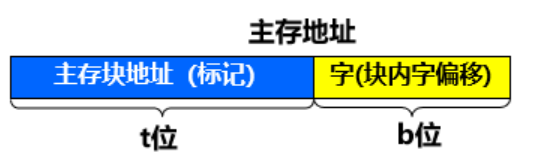

**全相联映射**：

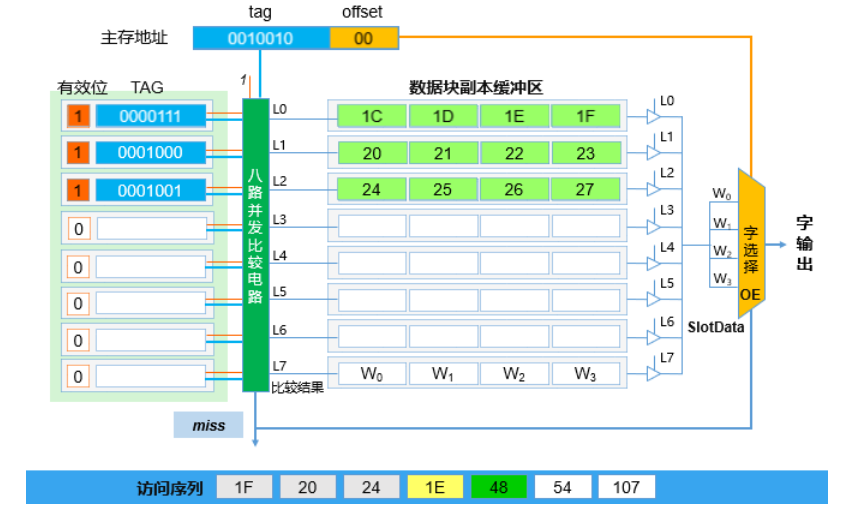

​	全相联映射使用最简单的主存地址编码方式，由tag主存块地址和offset块内偏移组成，使用8路并发比较电路，可以同时比较CAM中所有Tag和给定访问的主存地址的Tag是否一致，一致则命中（hit），否则miss。hit则到SRAM中根据offset访问字并输出，否则到主存中读取并加入cache。CAM行中包含有效位标识该行是否存在Tag，Tag位存储相应位数的Tag，即为块地址。全相联映射中主存中任意一个块均可存储在cache中多个块中的任意一个内，为一对多映射，块映射灵活。cache都装满后才会出现块冲突，因而块冲突的概率低，cache利用率高。（命中率高，淘汰算法复杂？）。

**直接相联映射**

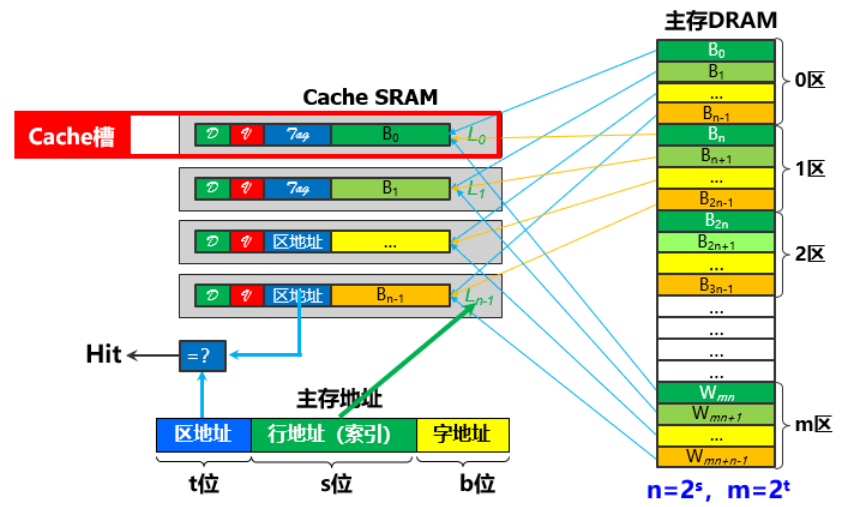

​	直接相联映射对主存中每cache行数个块进行分区，这使得主存中一个区内的各个块都能够落在不同的cache行内，一个cache行通常存储一个块。这种地址映射的方式中，主存地址分为三个部分，区地址作为Tag，行地址作为直接查询的索引，字地址供匹配Tag之后访问块内地址。这种方式下，不同区内的相对位置相同，mod cache行数同余的块都形成了竞争关系，无法选择别的cache行进行存储，因此存在旱得旱死涝得涝死的问题，cache利用率不高。

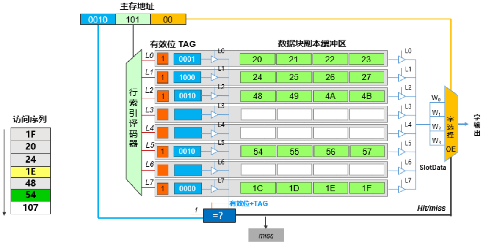

这种方式采用行索引译码器对行索引进行那个移码，就是将2进制译码为10进制来决定选择哪一行，同样的，通过有效位标识的是否存储数据块来决定是否进行区地址的判断，如若可以继续，则比较作为Tag的区地址，如若命中，则根据块内偏移量来访问SRAM中相应位置的数据，否则都从主存中将miss的块调入cache。可能存在行索引到的有效位无效，和tag位的区地址miss，造成的到主存中读取的情况。

由于直接相联映射可以根据索引直接相联到对应的块进行比较，因而块映射速度快，内存中给一个块只能映射到cache中特定的一行上，为一对一映射，无需查表。查找表与副本一起存放，无需相联存储器。但由于不同区内相对位置一样的块共同竞争一个cache存储块，因而cache容易冲突，cache利用率低。但由于当发生冲突时，直接在与它一对一映射的特定行进行替换即可，因而淘汰算法简单。但由于冲突率高，因而命中率低，适合大容量的cache，因为行数多了，在主存容量相同的情况下，每个区内的块数多，分区数目少，使得争夺同一行的不同区的相同位置的块的数目减少，冲突率就降低了，利用率就高了。

**组相联映射**

将cache分为特定组，将cache的组数作为对主存分区中每一个区内的块数，本质上是使得相同区内的不同块都分布到cache的不同组内。组相联映射类比到直接相联映射，二者的区别在于，后者的组数就是行数，而前者的组数是自定义的，每一组内的cache块进行全相联映射，每一组内的组数k标识k路组相联。cache分组方便索引，组内全相联映射使得冲突率降低，命中率提高。也就是说，直接相联映射中主存中同区的各个块落在不同的cache组内，而各组只有一行，因而不同区的相同位置只能共同争夺一行，冲突率高，而组相联映射中各区相同位置映射到同一cache组内有多于1行，因而降低了冲突率。二者的共同点在于，直接相联映射的组数等于行数，而主存分区内的块数也等于组数（行数），而组相联映射的组数小于行数，使得每一组内有多于1行，而主存分区内的块数依然等于分组数。要记住，本质上，都是使得主存同一区内的各块分布到cache的不同组中去。

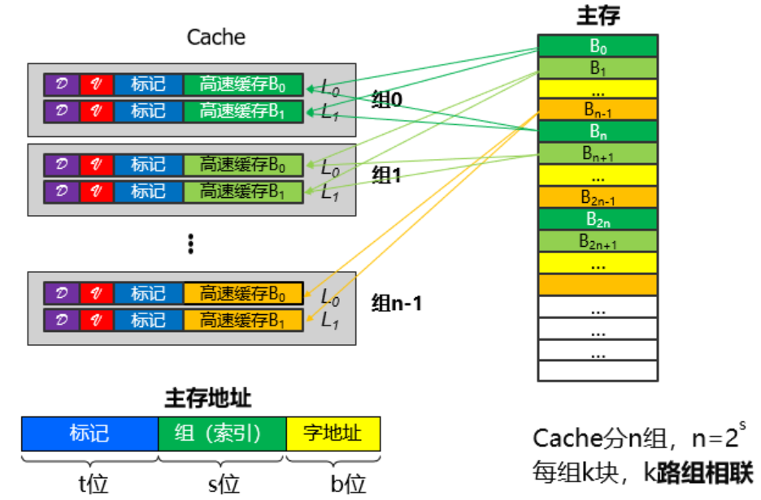

组相联映射的主存地址分为3部分，组索引标识cache中的各个组，组内的块由主存中mod 组数同余的块构成。在索引到组中后，通过顺序查询，比对组内的各行的Tag是否与给定的主存地址的组号一致，一致则命中，根据块内偏移量读取字，否则从主存中加载到cache中。

首先使用组索引译码器，将2进制译码为10进制来选择cache内某一组，再使用译码出的组号和Tag主存组号，对特定cache组的所有行在K路并发比较器内进行比较，命中则使用offset进行字选择，否则从主存中调取到cache。

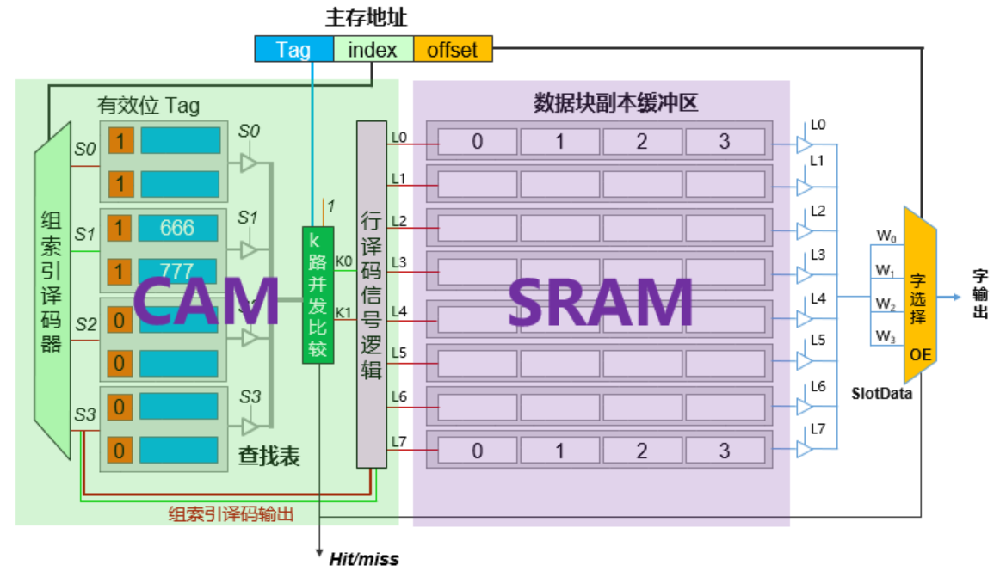

由于组相联映射对于cache的利用率较高，因此也适合容量小的cache。

对于容量大的可以采用直接映射的方式，查找速度较快，大容量cache可以缓解冲突的问题。

主存块大小和cache块大小一致，也就是说块的数据量一致

计算机一般按字节编址，因而先得出块的大小：字节量

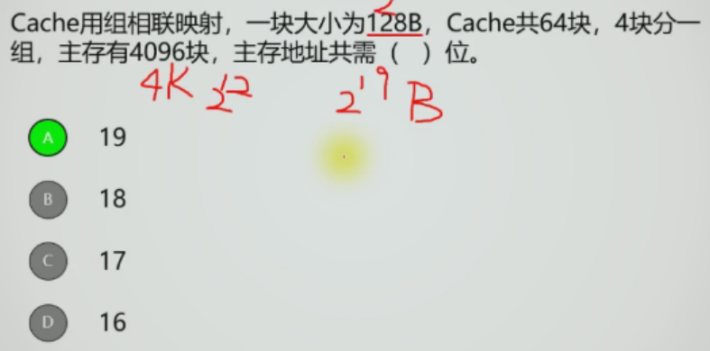

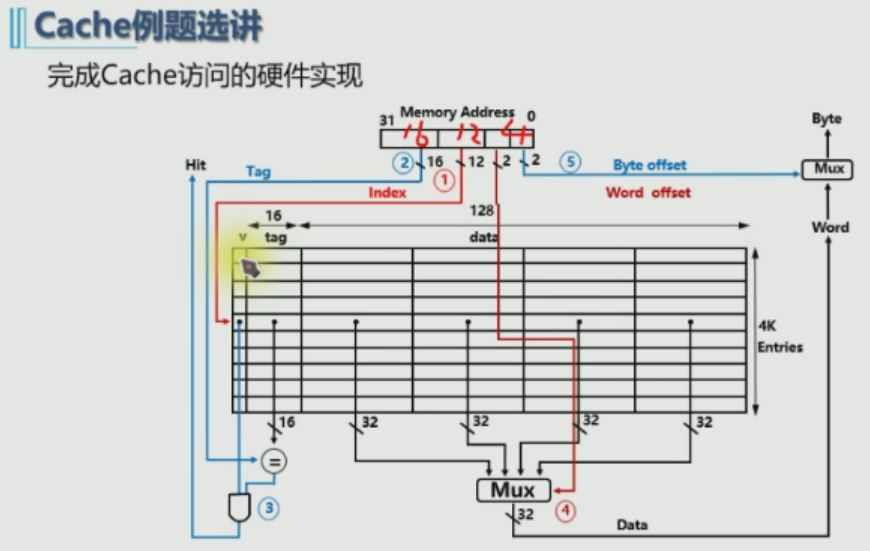

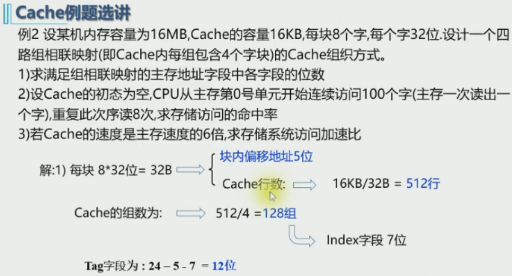

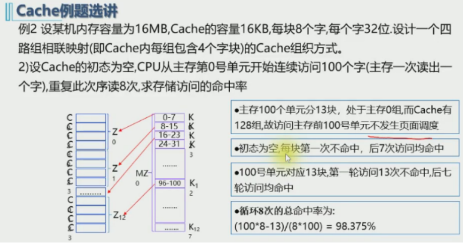

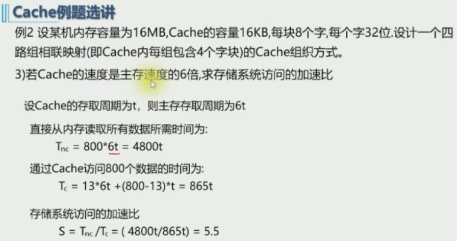

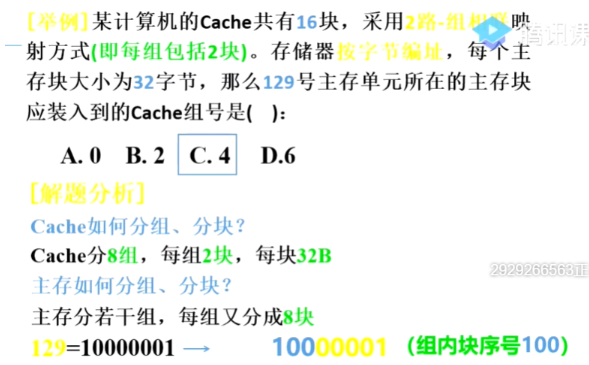