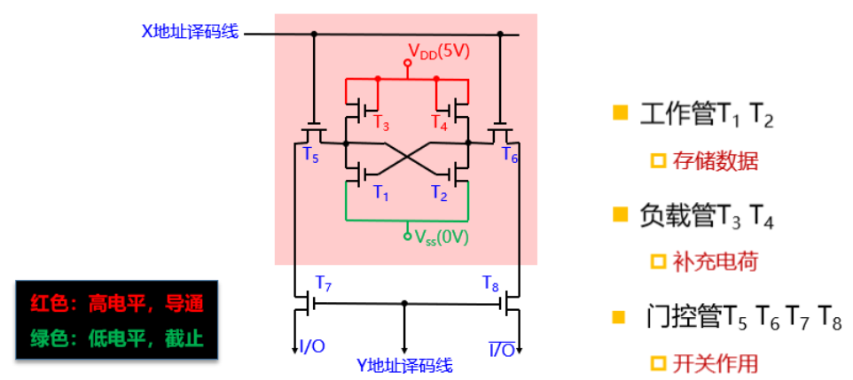
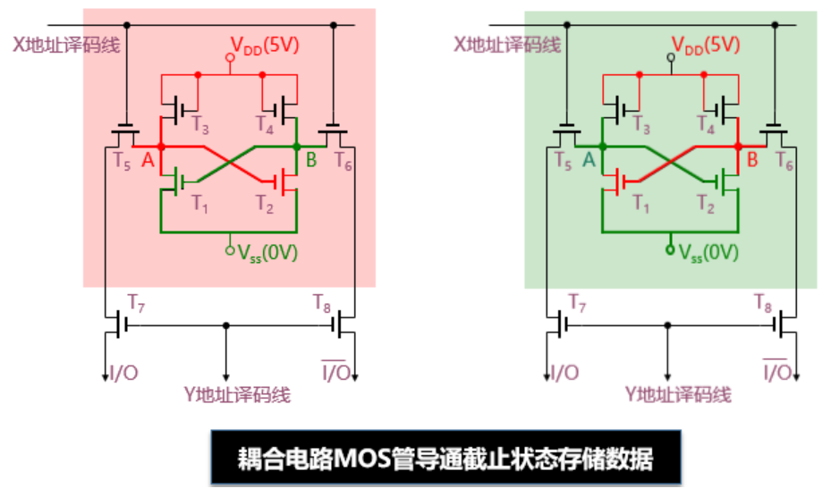

### 随机存取存储器（Random Access Memory）

随机存储器分为静态MOS存储器（SRAM）和动态MOS存储器（DRAM）。

**SRAM的单个单元的硬件理解如下：**

使用T1和T2存储01数据，T3和T4通过对T1和T2补充电荷维持01状态，T5678作为门控管，只有当X地址译码线和Y地址译码线都连通时门控管才接通，才有外界对内改变存储01数据的可能。

以上为存储01数据的不同状态。

