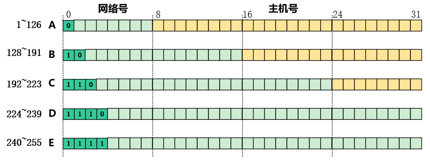

# 网络层 —— $IP$地址

## **$IP$地址概述**

- 全世界范围内唯一定位每个连接在互联网上的计算机和网络设备
- 32位二进制；按字节划分成4部分；点分十进制表示

### 点分十进制 基本规律

| 单字节的二进制 |              十进制计算规律               | 结果    |
| :------------: | :---------------------------------------: | ------- |
|    00000000    |                     0                     | **0**   |
|  **1**0000000  |                $2^7 = 128$                | **128** |
|  **11**000000  |       $2^7 + 2^6 = 128 + 64 = 192$        | **192** |
|  **111**00000  |            $2^8 -1 -31  = 224$            | **224** |
|  **1111**0000  |             $2^8 -1-15 = 240$             | **240** |
|  **11111**000  |             $2^8-1 -7 = 248$              | **248** |
|  **111111**00  |             $2^8-1 -3 = 252$              | **252** |
|  **1111111**0  |             $2^8-1 -1 = 254$              | **254** |
|  **11111111**  |              $2^8 -1 = 255$               | **255** |
|  11**0**11111  |        $255 - 2^5 = 255-32 = 123$         | **123** |
|  11111**0**11  |             $255 - 2^2 = 251$             | **251** |
|    01111111    |           $2^7-1 = 128-1 = 127$           | **127** |
|    00011111    |            $2^5-1 = 32-1 = 31$            | **31**  |
|    11011001    | $2^8-1 - 2^5 - 2^2 -2^1 = 255-32-4-2=217$ | **217** |

### 地址类型

#### 概述

- 点分十进制的第一位十进制即可分辨该地址的类型，从而区分网络号和主机号的位数。
- 网络号0为保留地址代指本网络，$0.0.0.0$表示本网络上本主机
- 网络号$127.0.0.0$为环路自检地址，表示任意主机本身，目的地址为环回地址的$IP$数据报不出现在任何网络上
- $255.255.255.255$为整个$TCP/IP $网络的广播地址,等效为本网络的广播地址
- 网络号确定的情况下，全0的主机号为该网络号本身
- 网络号确定的情况下，全1的主机号为该网络的广播地址

| 网络类别 | 最大可用网络数  | 首个可用网络号      | 最末可用网络号   | 单个网络中的最大主机数 |
| :------: | :-------------: | :------------------ | ---------------- | ---------------------- |
|    A     | $2^7-1-2 = 125$ | $00000001;1$        | $01111110 = 127$ | $2^{24}-2$             |
|    B     |  $2^6-1 = 63$   | $10000000;128.1$    | $10111111 = 191$ | $2^{16}$               |
|    C     |  $2^5-1 = 31$   | $11000000 ;192.0.1$ | $11011111 = 123$ | $2^8 -2 = 254$         |

